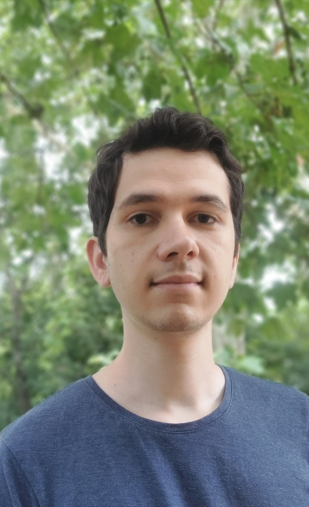

# Théo Martinez
## Biographie

Je suis un ingénieur en robotique de l'école Centrale Nantes. Je viens de terminer une expérience de 2 ans au LAAS-CNRS au sein de l'équipe [Gepetto](https://www.laas.fr/fr/equipes/gepetto/) en tant qu'ingénieur de recherche. J'y ai travaillé sur du contrôle optimal (MPC) dans le cadre du projet européen [agimus](https://www.agimus-project.eu/) sous la supervision de [Nicolas Mansard](https://gepettoweb.laas.fr/index.php/Members/NicolasMansard).

Je suis spécialisé dans la programmation et le contrôle. je suis intéressé par la robotique et les transports autonomes.

[Github](https://github.com/TheoMF)     [Linkedin](https://www.linkedin.com/in/th%C3%A9o-martinez-38b715198/) [Codingame](https://www.codingame.com/profile/96e55fec026ca228f3237fd0e8e046899270025)

## Projets

### Contrôle Optimal (MPC) sur le robot Panda

Lors de mon expérience dans l'équipe Gepetto, j'ai développé au sein d'une équipe une librairie de contrôle optimal. Le but était de pouvoir réaliser un suivi de trajectoire, tout en faisant de l'évitement d'obstacles, de l'asservissement visuel ou bien du contrôle de force. Plusieurs vidéos de démonstrations sont disponibles.

[Github](https://github.com/agimus-project/agimus_controller)  [video1](https://peertube.laas.fr/w/p/7xYdnDaQujxmgtBJpSsd2s?playlistPosition=2&resume=true) [video2](https://peertube.laas.fr/w/6hnN96zyP7ADvGvyop3hfw)

### Tri sélectif avec le robot Le kiwi

Je travaille actuellement sur un projet personnel pour réaliser un tri sélectif avec les robots de Hugging Face SO-101 et le kiwi.